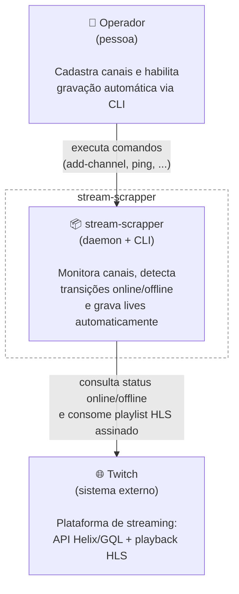
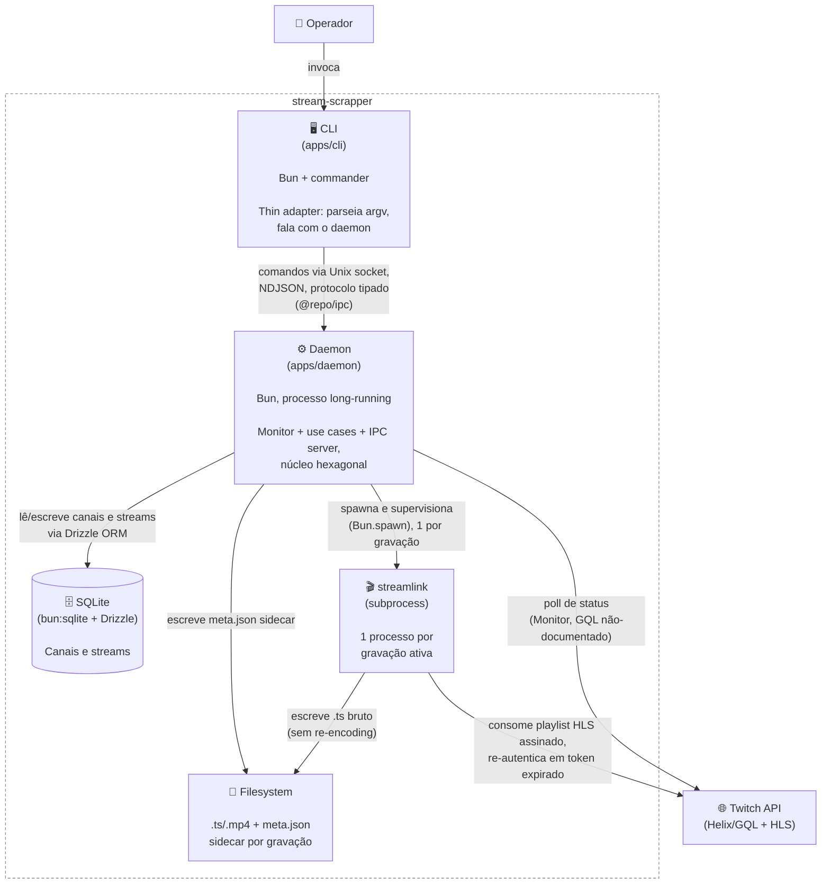
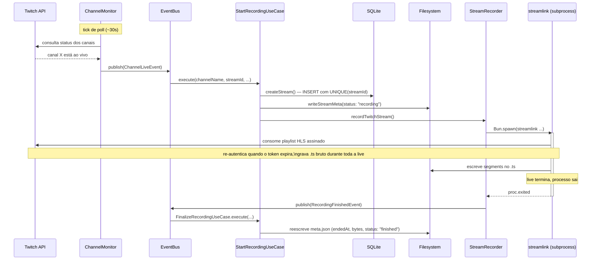

# Arquitetura — visão C4

Diagramas em [C4 Model](https://c4model.com/): Context (nível 1) e Container
(nível 2) cobrem a maioria das perguntas de "o que é isso e como se
comunica"; um diagrama Dynamic complementa mostrando o fluxo assíncrono mais
importante do sistema em tempo de execução. Component/Code (níveis 3-4) foram
deixados de fora deliberadamente — nenhum container aqui é complexo o
suficiente pra justificar esse zoom; a leitura do código em
[apps/daemon/src/](../../apps/daemon/src/) resolve melhor esse nível de
detalhe do que um diagrama desenhado à mão.

Decisões que moldam estes diagramas estão registradas em
[docs/decisions/](../decisions/).

## Nível 1 — System Context

Quem usa o stream-scrapper e com quais sistemas externos ele conversa.

**Legenda:** caixa tracejada = fronteira do sistema. Setas rotuladas com o
verbo da relação (não são só "conexões" — dizem o que passa por elas).

## Nível 2 — Containers

Zoom pra dentro da fronteira: as unidades que rodam separadamente e como se
falam. "Container" aqui é qualquer coisa que executa isolada — processo,
datastore, subprocesso — **não** é container Docker (o projeto não usa
Docker).

**Legenda:** retângulo = processo/aplicação · cilindro = datastore ·
pasta = filesystem · fronteira tracejada = mesmo host (ver
[ADR 003](../decisions/003-unix-socket-ipc.md), CLI e daemon sempre rodam
juntos). `packages/ipc` não aparece como container próprio — é a biblioteca
de protocolo compilada dentro dos dois processos, não uma unidade que roda
sozinha.

## Diagrama suplementar — Dynamic: canal fica live → grava → finaliza

O fluxo mais espinhoso do sistema é assíncrono e atravessa dois driving
adapters (Monitor e IPC) através do EventBus — ver
[events-evolution.md](../../apps/daemon/notes/events-evolution.md) e
[monitor-tick-serialization.md](../../apps/daemon/notes/monitor-tick-serialization.md)
pro raciocínio completo por trás dele. Este diagrama fixa o cenário de
sucesso ponta-a-ponta.

**Legenda:** setas cheias = chamada síncrona/await · seta tracejada = retorno
ou evento assíncrono · `Note over` = observação temporal, não uma mensagem.
