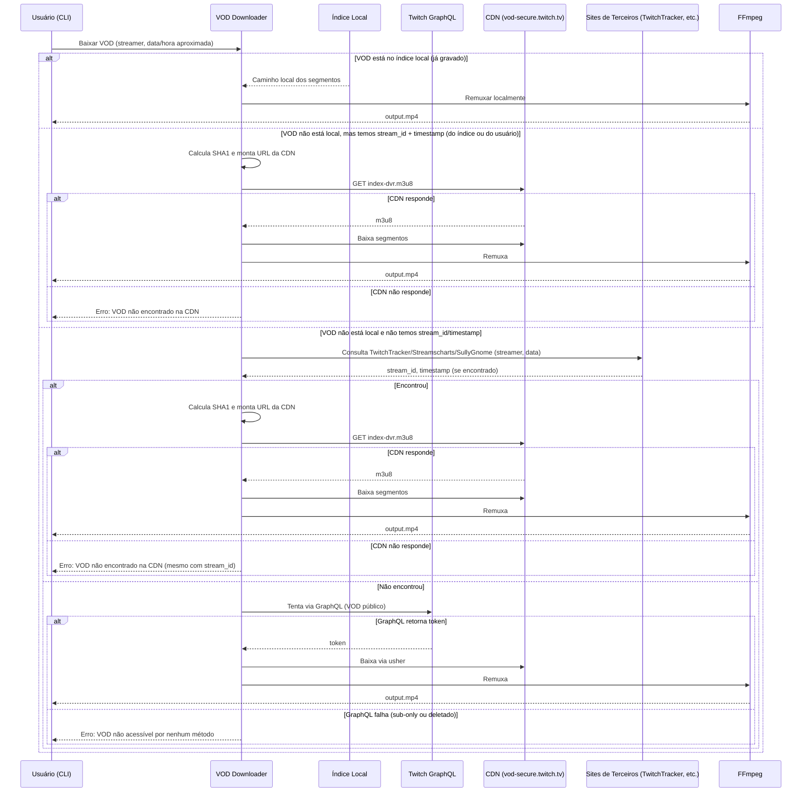
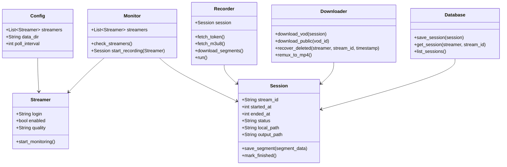

# Especificação Arquitetural – Twitch VOD/Live Recorder (MVP Local)

## 1. Objetivo

Sistema local (rodando na sua máquina) que:
- **Monitora** uma lista de streamers da Twitch.
- **Grava** automaticamente as transmissões ao vivo em tempo real (salvando os segmentos `.ts` localmente).
- **Permite baixar** VODs já finalizados (tanto os gravados localmente quanto os disponíveis na CDN da Twitch, incluindo ocultos/deletados, desde que se tenha o `stream_id` e `timestamp`).
- **Disponibiliza** os vídeos finais (`.mp4`) via FFmpeg.

## 2. Restrições e premissas

- Execução **local** (sem nuvem).
- Falhas de energia/desligamento são aceitas — o sistema deve ser **resiliente**: ao reiniciar, deve retomar a gravação de streams ativas ou pelo menos não corromper os arquivos já baixados.
- O usuário gerencia a lista de streamers manualmente (arquivo de configuração).
- O FFmpeg deve estar instalado no sistema para a etapa de remux (junção dos segmentos em `.mp4`).

---

## 3. Componentes do sistema (visão lógica)

```mermaid
graph TD
    A[Scheduler / Timer] --> B[Monitor]
    B --> C{Streamer está ao vivo?}
    C -->|Sim| D[Recorder (Live Grabber)]
    C -->|Não| A
    D --> E[Armazenamento local (Segmentos .ts)]
    E --> F[Post-Processor (FFmpeg)]
    F --> G[Vídeo final .mp4]
    
    H[Usuário via CLI] --> I[VOD Downloader]
    I --> J[Twitch GraphQL / CDN]
    J --> E
    I --> K[Índice local (SQLite/JSON)]
    K --> I
```

---

## 4. Fluxo de dados detalhado

### 4.1. Fluxo de Monitoramento e Gravação ao Vivo

```mermaid
sequenceDiagram
    participant S as Scheduler
    participant M as Monitor
    participant T as Twitch API (Helix)
    participant G as Twitch GraphQL
    participant R as Recorder
    participant D as Disco (Segmentos)
    
    loop A cada X minutos (ex: 3 min)
        S->>M: Verificar streamers da lista
        M->>T: GET /helix/streams?user_login=streamerX
        T-->>M: {is_live, stream_id, started_at, title}
        alt Está ao vivo
            M->>R: Iniciar gravação (streamer, stream_id, started_at)
            R->>G: PlaybackAccessToken (login=streamerX, isLive=true)
            G-->>R: {token, signature}
            R->>T: GET usher.ttvnw.net/api/channel/hls/streamerX.m3u8?token=...
            T-->>R: m3u8 mestre (qualidades)
            R->>R: Escolhe a melhor qualidade (ou a configurada)
            
            loop Enquanto live estiver ativa (Monitor checa em paralelo)
                R->>T: GET m3u8 da qualidade (atualizado a cada ~4s)
                T-->>R: Lista de segmentos (.ts)
                R->>R: Identifica segmentos novos (não baixados)
                par Baixar segmentos em paralelo
                    R->>D: Salva segmento_0001.ts
                    R->>D: Salva segmento_0002.ts
                    ...
                end
                R->>R: Atualiza índice local (stream_id, último segmento)
                Note over R: Pausa de ~2-4s antes de recarregar m3u8
            end
            
            R->>M: Live encerrada
            M->>M: Marca stream como "finalizada"
            R->>F: Chama FFmpeg para juntar segmentos
            F->>D: Gera output.mp4
        else Não está ao vivo
            M-->>S: Nada a fazer
        end
    end
```

### 4.2. Fluxo de Download de VOD (público ou recuperado)



---

## 5. Estrutura de dados (Índice local)

Para que a recuperação de VODs ocultos funcione, você precisa guardar **todo** `stream_id` e `timestamp` de todas as lives que seu sistema já viu (ou que você adicionou manualmente via TwitchTracker).

Sugestão: **SQLite** (leve, transacional, fácil de consultar). Se quiser algo ainda mais simples, um `JSON` ou `CSV` serve para um MVP, mas o SQLite é mais robusto para consultas futuras.

### Esquema SQLite (proposto)

```sql
-- Tabela de streamers monitorados
CREATE TABLE streamers (
    id INTEGER PRIMARY KEY,
    login TEXT UNIQUE NOT NULL,          -- "cogu"
    enabled BOOLEAN DEFAULT 1,           -- se deve ser monitorado
    quality TEXT DEFAULT 'best'          -- '1080p', '720p', 'best'
);

-- Tabela de sessões de stream (cada live é uma sessão)
CREATE TABLE sessions (
    id INTEGER PRIMARY KEY,
    streamer_id INTEGER NOT NULL,
    stream_id TEXT NOT NULL,             -- ID numérico da stream
    started_at INTEGER NOT NULL,         -- Unix timestamp (UTC)
    ended_at INTEGER,                    -- Unix timestamp (UTC), NULL se ainda ao vivo
    title TEXT,
    game_name TEXT,
    local_path TEXT,                     -- Pasta onde os segmentos foram salvos
    output_path TEXT,                    -- Caminho do .mp4 final, se gerado
    status TEXT DEFAULT 'recording',     -- 'recording', 'finished', 'failed'
    FOREIGN KEY (streamer_id) REFERENCES streamers(id)
);

-- Índice para busca rápida por streamer + stream_id
CREATE UNIQUE INDEX idx_sessions_streamer_stream ON sessions(streamer_id, stream_id);
```

**Justificativa:** Com `streamer_id` e `stream_id` gravados, você tem exatamente os dois dados necessários para calcular o hash da CDN da Twitch mesmo que a Twitch delete o VOD da interface.

**Observação sobre obtenção de `stream_id` e `timestamp`:**

Nem sempre o sistema estará monitorando todos os streamers. Para recuperar VODs de transmissões que você não monitorou, o sistema pode consultar **sites de terceiros** que arquivam metadados de streams:

- **TwitchTracker** (`twitchtracker.com`)
- **Streamscharts** (`streamscharts.com`)
- **SullyGnome** (`sullygnome.com`)

Esses sites disponibilizam o histórico de transmissões de cada canal, incluindo `stream_id`, data/hora de início e duração. O sistema deve implementar um módulo de **scraping** (ou usar APIs, se disponíveis) para consultar esses sites quando o `stream_id` e `timestamp` não estiverem no índice local.
---

## 6. Armazenamento de arquivos (estrutura de pastas)

```text
./data/
├── streamers.json          # Lista de streamers (ou SQLite)
├── index.db                # SQLite com as tabelas acima
├── segments/               # Segmentos brutos .ts
│   └── {streamer_login}/
│       └── {stream_id}/
│           ├── session.json  # Metadados daquela sessão (backup)
│           ├── segment_0001.ts
│           ├── segment_0002.ts
│           └── ...
└── videos/                 # Vídeos finais .mp4 (após FFmpeg)
    └── {streamer_login}/
        └── {stream_id}.mp4
```

**Observação:** A pasta `segments/` pode crescer muito. Você pode implementar uma política de retenção (ex.: manter apenas os últimos 7 dias) ou manualmente excluir as pastas antigas.

---

## 7. Requisitos não-funcionais e decisões arquiteturais

| Aspecto | Decisão | Motivo |
|---------|---------|--------|
| **Monitoramento** | Polling a cada 2-5 minutos via API Helix | API gratuita, rate limit generoso (dezenas de req/min). |
| **Gravação ao vivo** | Baixar segmentos em paralelo (10-20 threads) | VOD de 6h tem ~2000 segmentos; serial demora muito. |
| **Resiliência** | Guardar último segmento baixado no SQLite | Se o sistema cair, ao reiniciar ele sabe onde parou. |
| **FFmpeg** | Chamada externa via subprocesso | Não reinventar a roda; o FFmpeg já faz o remux perfeitamente. |
| **Qualidade** | Escolher a melhor disponível (ou fixa) | O m3u8 mestre lista todas; basta filtrar. |
| **VODs públicos** | Usar GraphQL + `vodID` | Fluxo padrão, funciona para VODs listados. |
| **VODs ocultos/deletados** | Usar hash SHA1 + CDN direta | Requer `stream_id` e `timestamp` (guardados no SQLite). |

---

## 8. Interface do usuário (MVP)

Sugiro uma **CLI** (linha de comando) inicial, com comandos como:

```bash
# Adicionar um streamer para monitorar
./twitch-recorder add streamer cogu

# Listar streamers monitorados
./twitch-recorder list

# Iniciar o daemon de monitoramento/gravação (roda em background)
./twitch-recorder daemon start

# Baixar um VOD específico (usando stream_id ou ID do VOD)
./twitch-recorder download vod --streamer cogu --stream-id 44841720763 --timestamp 1726938842

# Baixar um VOD público (usando o ID da Twitch)
./twitch-recorder download vod --vod-id 1234567890
```

Mais tarde, se quiser, pode adicionar uma interface web (ex.: um dashboard local em `http://localhost:8080`). Mas para um MVP, a CLI é mais rápida de construir e suficiente.

---

## 9. Diagrama de classes (conceitual) – para visualizar os módulos



## 10. Estratégias de Acesso a VODs Restritos (Sub-Only, Deletados, Ocultos)

O sistema deve ser capaz de baixar VODs mesmo quando a Twitch os restringe (subscriber-only) ou os remove da interface (deletados/ocultos). Para isso, utilizamos três estratégias complementares:

### 11.1. Acesso Direto à CDN (via Hash) – **Recomendado para VODs sub-only e deletados**

**Como funciona:** A Twitch armazena todos os VODs na CDN com uma URL previsível baseada em `streamer + stream_id + timestamp`. A restrição "sub-only" é apenas um controle de acesso no *player* da Twitch, não no arquivo em si.

**Requisito:** Ter o `stream_id` e o `timestamp` da transmissão (obtidos via monitoramento próprio ou via sites de terceiros).

**Passos:**
1.  Calcular `hash = SHA1(streamer + "_" + stream_id + "_" + timestamp)[:20]`.
2.  Montar URL: `https://vod-secure.twitch.tv/{hash}_{streamer}_{stream_id}_{timestamp}/chunked/index-dvr.m3u8`.
3.  Fazer GET na URL. Se responder 200, o VOD está acessível **independentemente** de você ser inscrito ou não.
4.  Baixar os segmentos e remuxar com FFmpeg.

**Observação:** Esta técnica funciona para VODs que ainda estão na CDN (janela de ~60 dias). É a mais poderosa porque não exige autenticação.

### 11.2. Uso de Cookies/Sessão (para VODs sub-only via API GraphQL)

**Como funciona:** Se o VOD estiver restrito a inscritos e a técnica de acesso direto à CDN falhar (por exemplo, se a Twitch mudar a estrutura de hash), é possível usar uma conta com assinatura ativa para obter o token via GraphQL.

**Requisito:** Ter acesso a cookies de uma conta que é inscrita no canal (própria ou de terceiros).

**Passos:**
1.  Fazer a requisição GraphQL para `PlaybackAccessToken` com o header `Authorization: OAuth <token>` (obtido dos cookies).
2.  A resposta virá com `forbidden: false` e o token será válido.
3.  Usar o token no usher para obter o m3u8 e baixar o VOD.

**Observação:** Esta técnica é mais frágil (depende de credenciais) e pode violar os ToS da Twitch se usada com contas de terceiros. Para um projeto pessoal, é uma opção válida.

### 11.3. Gravação em Tempo Real (a estratégia "infalível")

**Como funciona:** Se você estiver monitorando um streamer **enquanto ele está ao vivo**, pode gravar a transmissão em tempo real. Nesse momento, o conteúdo é público e acessível a qualquer um.

**Requisito:** O sistema deve estar rodando e monitorando o streamer antes/durante a live.

**Passos:**
1.  O Monitor detecta que o streamer entrou ao vivo.
2.  O Recorder inicia a captura dos segmentos `.ts` assim que eles são gerados.
3.  Quando a live termina, todos os segmentos já estão salvos localmente.
4.  O FFmpeg junta os segmentos em um `.mp4`.

**Vantagem:** Este método **garante** o acesso ao conteúdo, independentemente de o VOD ser deletado ou restrito posteriormente. É exatamente o que o StreamRecorder.io faz.

**Desvantagem:** Requer que o sistema esteja rodando no momento da live e que haja espaço em disco para armazenar os segmentos.